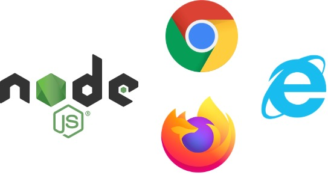

### Do a write up for the followings:
1. HTTP Version History
2. Difference between HTTP1.1 vs HTTP2 
3. List 5 difference between Browser JS(console) vs Nodejs
4. what happens when you type a URL in the address bar in the browser?


### A BRIEF HISTORY OF HTTP?
#### WHY A PROTOCOL?

Protocols are set of rules that guide conversation. Just like humans communications, computers also need such set of rules. What would happen if there are no such rules? Same things happens when lets say two human beings start talking over each other in a language foreign to eachother. Basically resulting in
- Loss of information
- Incorrect information

Thus defeating the purpose. There are many protocols that govern communication between two computers (remember a server is also a computer).
```
- FTP = File Transfer Protocol
- SMTP = Simple Mail Transfer Protocol
- SMB = Server Message Block Protocol 
- TCP = Transfer Control Protocol
```

#### WHAT IS HTTP?

HTTP stands for *Hyper Text Transfer Protocol*. So basically it is a set of rules that two computers follow while transferring information over internet.

##### TIMELINE OF HTTP

1. HTTP/0.9
   - This was the initial version of HTTP. Request consisted of a single line and only `GET` method was possible. Since the request lackeed HTTP headers only HTML documents could be transmitted. Similarly there was no provision of status and error codes.
2. HTTP/1.0
   - This version allowed appending version information into the request at the same time idea of HTTP Headers was also introduced. This allowed transfer of metadata bringing in flexibility of transmitting documents other than simple HTML.
   - But these features were not added in a concrete institutionalized way, leading to difficulties in operation. Parallel to this a much more standardized approach was in progress the result of which was HTML/1.1
3. HTTP/1.1
   - This brought some much needed improvements such as
      - Reuse of connection was now possible thus repeated reopening of connection was not needed
      - Use of `Host` in headers allowed hosting different domains at same IP address
4. HTTP/2
   - HTTP/2 is the outcome of dealing with limitations of HTTP/1.1 due to increase in content heavy and complicated websites
   - **SEE BELOW FOR MORE DETAILS**
5. HTTP/3
   - Both HTTP/1.1 and HTTP/2 use TCP as their transport. This is where HTTP/3 differs, it uses [QUIC](https://en.wikipedia.org/wiki/QUIC). 
   -HTTP/2 removed the line blocking in *Application Layer*. But the same problem could also happen in transport layer which is a limitation of TCP. HTTP/3 by using QUIC strives to solve this issue.


### DIFFERENCE BETWEEN HTTP/1.1 VS HTTP/2?

HTTP/1.1 has become sine qua non for the internet. But gradually as the webpages started to become more complex and resource demanding the limitations of HTTP/1.1 started coming to fore. HTTP/2 aims to be faster and more efficient than HTTP/1.1 through the use of following technologies.
- PRIORITIZATION - HTTP/2 allows for detailed control over which page resources will load first. For E.g. adds will load up after the content has been loaded. This helps in the webpage to appear snappy.
- MULTIPLEXING - In HTTP/1.1 resources ar loaded in sequence, therefore if one resource is blocked all subsequent resources will not be able to load up. Think of it as a single lane road between city -'A' and city -'B'. HTTP/2 sets up multiple streams of data - like a multilane high way between to cities
- BETTER COMPRESSION - HTTP/2 uses a more advanced compression technique called *HPACK*. This eliminates redundancy from HTTP headers leading to fewer packets per webpage. Thus webpage load quickly


### BROWSER JS(CONSOLE) AND NODE-JS. BOTH HAVE 'JS' - SO WHAT IS THE DIFFERENCE?



Up until a little over a decade one could only use JavaScript (JS) in browser. This was a serious limitation on the power of JS at same time, made back-end scripting using JS impossible. Ryan Dahl recognized the challenge while updating a progress meter on a web page for uploading files with Ruby web servers in 2009 and created an environment to run JS codes without any browser. Thus **Node-Js** was born. Although both Browser JS (Console) and Node-JS run JS codes there are vital differences
- Browser console does not have access to file system but Node-JS has complete access to system like any other native application.
- Node-JS runs back-end JS codes where as Browser JS (Console) runs front-end JS.
- [npm](https://www.npmjs.com/) is a package manager available for Node-JS something that browsers lack. This allows Node access to thousands of pre-built packages also known as modules.
- window object, document object is absent in Node-JS but is available to Console.
- 


### UNDERSTAND THE 'PHONE-CALL' BETWEEN TWO FRIENDS - BROWSER AND INTERNET? 
1. REQUEST AND RESPONSE CYCLE
